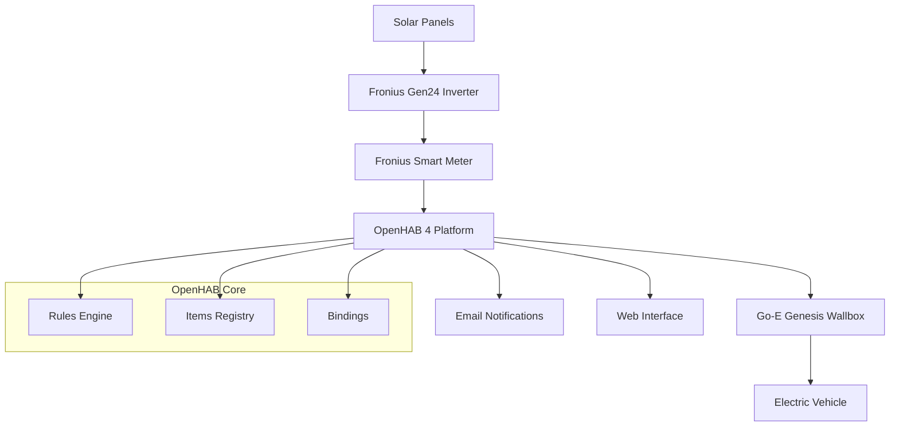
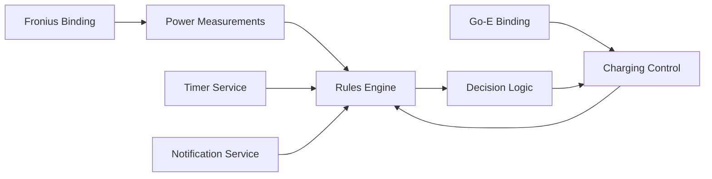
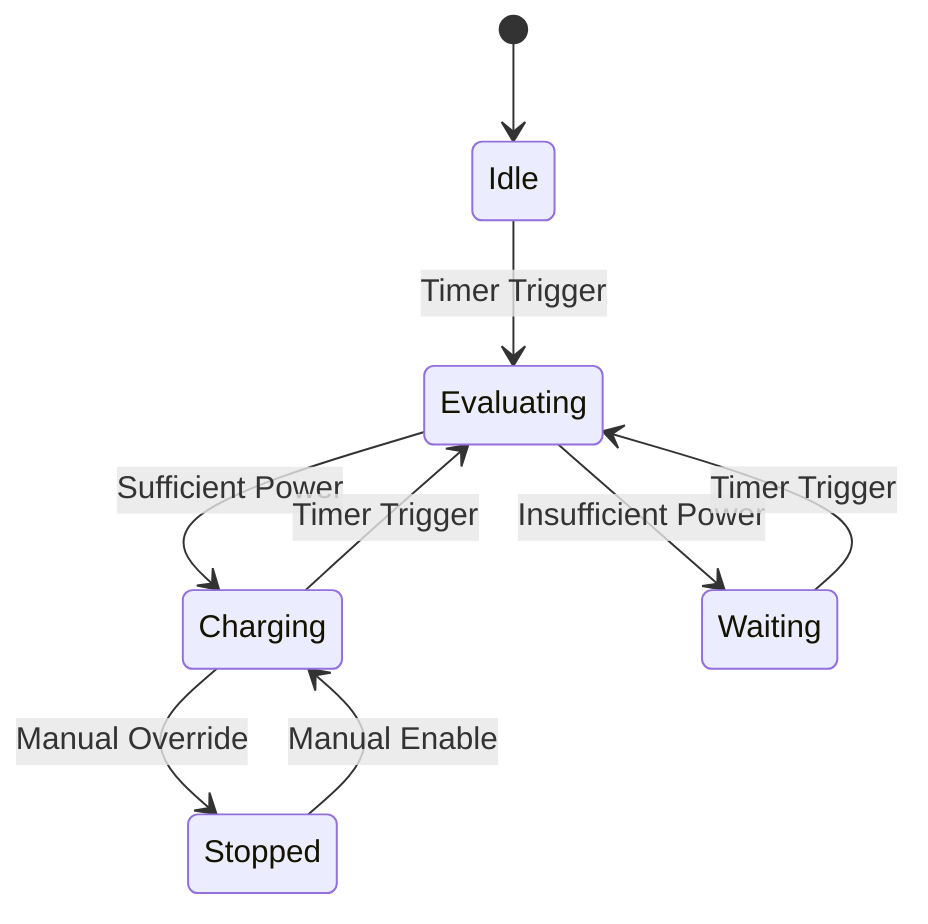
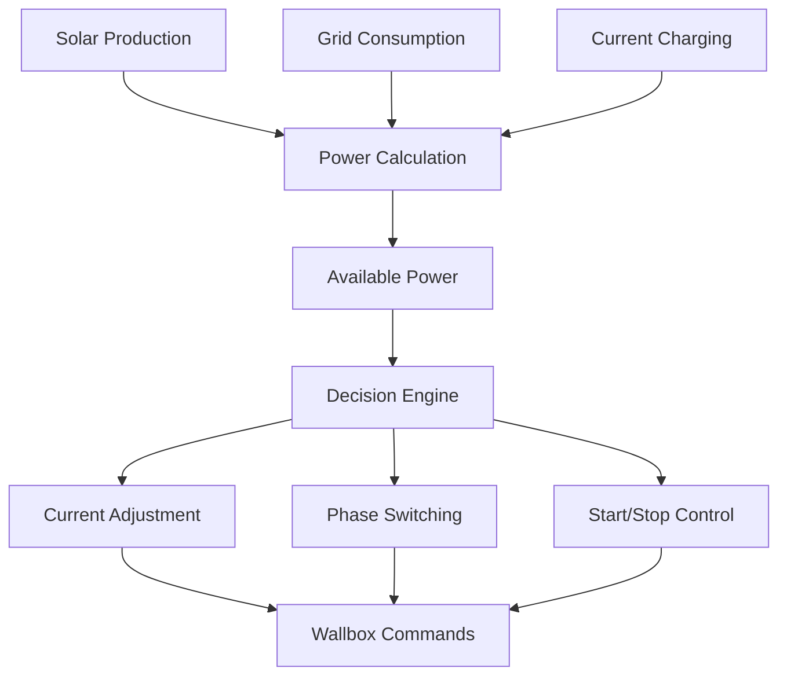

# System Architecture

## Overview
The OpenHAB Solar EV Charging system implements an event-driven architecture that optimizes electric vehicle charging using excess solar power. The system integrates multiple hardware components through OpenHAB's binding framework.

## High-Level Architecture

## Component Integration

## Design Patterns

### 1. Event-Driven Control
- **Trigger:** Time-based cron expression (`*/30 * * * * ?`)
- **Pattern:** Reactive system responding to power availability changes
- **Benefits:** Real-time adaptation to solar conditions

### 2. State Machine Pattern

### 3. Hysteresis Control
- **Purpose:** Prevent rapid switching between states
- **Implementation:** Power and current thresholds with different up/down values
- **Example:** 1380W ± 200W for single-phase switching

### 4. Countdown Timer Pattern
- **Purpose:** Stability control for major state changes
- **Implementation:** Configurable countdown cycles before action
- **Types:** Charging start/stop, phase switching

## Data Flow Architecture

## Integration Patterns

### Hardware Abstraction Layer
- **Fronius Integration:** Modbus-based power measurements
- **Go-E Integration:** Direct API control for charging parameters
- **Abstraction:** OpenHAB items provide unified interface

### Configuration-Driven Design
- **Constants:** Centralized configuration at rule level
- **Flexibility:** Easy adjustment without code changes
- **Parameters:** Power limits, hysteresis values, timer durations

### Safety-First Architecture
- **Fail-Safe:** System defaults to safe states on errors
- **Validation:** Input validation and boundary checking
- **Monitoring:** Comprehensive logging and notifications

## Scalability Considerations

### Current Limitations
- Single wallbox support
- Fixed power calculation algorithm
- Hardcoded notification email

### Extension Points
- Multiple wallbox support via item groups
- Pluggable power calculation strategies
- Configurable notification channels
- Dynamic pricing integration potential

## Performance Characteristics
- **Execution Frequency:** Every 30 seconds
- **Response Time:** Near real-time (sub-minute)
- **Stability:** Countdown timers prevent oscillation
- **Efficiency:** Minimal computational overhead
