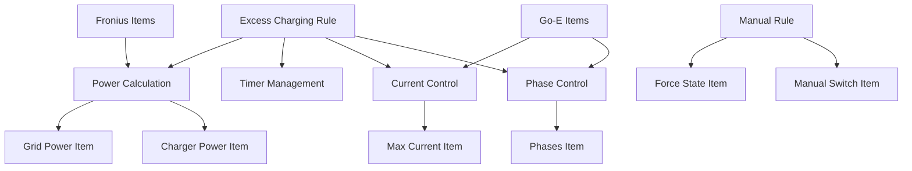

# System Components

## Core Rules

### 1. Excess Charging Control Rule
**File:** `solar.rules`  
**Trigger:** `Time cron "*/30 * * * * ?"`  
**Purpose:** Main automation logic for solar excess charging

#### Responsibilities
- Calculate available power for charging
- Adjust charging current dynamically (6-16A)
- Switch between 1-phase and 3-phase charging
- Implement stability controls with countdown timers
- Send notifications for state changes

#### Key Configuration Constants
```javascript
val int minCurrent = 6                    // Minimum charging current
val int maxCurrent = 16                   // Maximum charging current  
val int singlePhasePowerLimit = 1380      // 1-phase power threshold
val int threePhasePowerLimit = 4140       // 3-phase power threshold
val int powerHysteresis = 200             // Phase change hysteresis
val int currentHysteresis = 1             // Current adjustment threshold
```

#### Control Logic Flow
1. **Exit Conditions Check:** Validates car connection and excess charging mode
2. **Power Calculation:** Determines available power from grid and current usage
3. **Timing Validation:** Ensures minimum time between state changes
4. **Countdown Management:** Handles stability timers for major changes
5. **Current Adjustment:** Optimizes charging current based on available power
6. **Phase Switching:** Switches between 1-phase/3-phase based on power availability

### 2. Manual Charging Control Rule
**File:** `solar.rules`  
**Trigger:** `Item ManuellLaden changed`  
**Purpose:** Override automation with manual control

#### Responsibilities
- Enable/disable manual charging mode
- Override excess charging when manual mode active
- Provide immediate charging control
- Send manual mode notifications

## Item Groups

### Power Monitoring Group
**Group:** `gPower`  
**Purpose:** Aggregate power measurements for charting and monitoring

**Members:**
- `Production_Power` - Current solar production
- `Load_Power_Negated` - Current household consumption
- `GoEChargerPowerAll` - Current charging power

### Fronius Inverter Items
**Prefix:** `AC_Power`, `Day_Energy`, `Grid_Power`, etc.  
**Binding:** `fronius:powerinverter`  
**Purpose:** Solar production and grid power measurements

#### Key Items
- `Production_Power` - Real-time solar production
- `Grid_Power` - Grid import/export power
- `Load_Power` - Household consumption
- `Power_Autonomy` - Energy independence percentage
- `Power_SelfConsumption` - Self-consumption rate

### Fronius Meter Items  
**Prefix:** `Meter_Power*`, `Meter_Energy*`  
**Binding:** `fronius:meter`  
**Purpose:** Detailed power measurements per phase

### Go-E Charger Items
**Prefix:** `GoECharger*`  
**Binding:** `goecharger:goe`  
**Purpose:** Wallbox control and monitoring

#### Control Items
- `GoEChargerMaxCurrent` - Charging current limit (6-16A)
- `GoEChargerPhases` - Number of active phases (1 or 3)
- `GoEChargerForceState` - Charging state control (0=Auto, 1=Off, 2=On)
- `GoEChargerTransaction` - Access control

#### Monitoring Items
- `GoEChargerPowerAll` - Total charging power
- `GoEChargerCurrentL1/L2/L3` - Current per phase
- `GoEChargerPowerL1/L2/L3` - Power per phase
- `GoEChargerSessionChargedEnergy` - Energy charged in current session
- `GoEChargerPwmSignal` - Car connection status
- `GoEChargerError` - Error codes

## Control Items

### System Control
- `ExcessCharging` - Enable/disable excess charging mode
- `ManuellLaden` - Manual charging override switch
- `AvailablePowerCharger` - Calculated available power for charging

### State Management
- `LastStateChangeTime` - Timestamp of last state change
- `LastPhaseChangeTime` - Timestamp of last phase change
- `LastAvailablePower` - Previous power calculation

### Countdown Timers
- `ChargingStopCountdown` - Countdown before stopping charging
- `ChargingStartCountdown` - Countdown before starting charging  
- `PhaseChangeCountdown` - Countdown before phase switching

## Component Interactions



## Safety Components

### Input Validation
- Car connection status checking (`GoEChargerPwmSignal`)
- Excess charging mode validation (`ExcessCharging`)
- Null state initialization for all countdown items

### Boundary Controls
- Current limits enforced (6-16A range)
- Power threshold validation
- Time-based change restrictions

### Error Handling
- Graceful handling of undefined states
- Automatic item initialization
- Comprehensive logging for troubleshooting

## Configuration Components

### Notification System
- Email notifications for state changes
- Configurable recipient address
- Status messages for all major events

### Timing Controls
- Configurable countdown durations
- Minimum time between changes
- Hysteresis values for stability

### Power Management
- Configurable power thresholds
- Phase switching logic
- Current calculation algorithms
