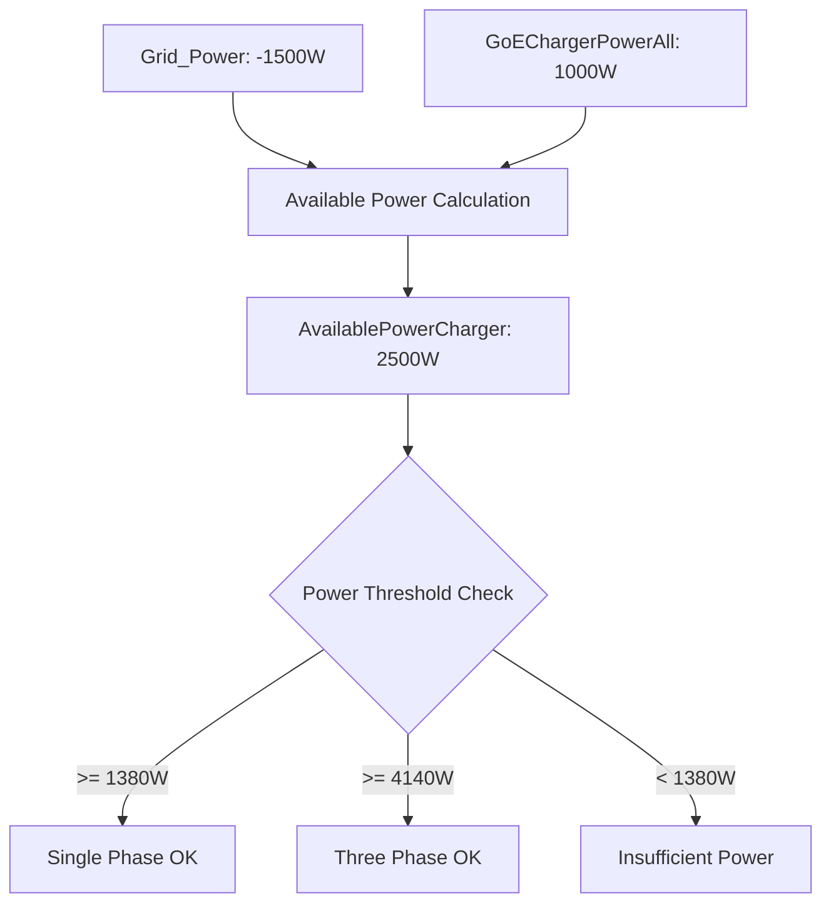
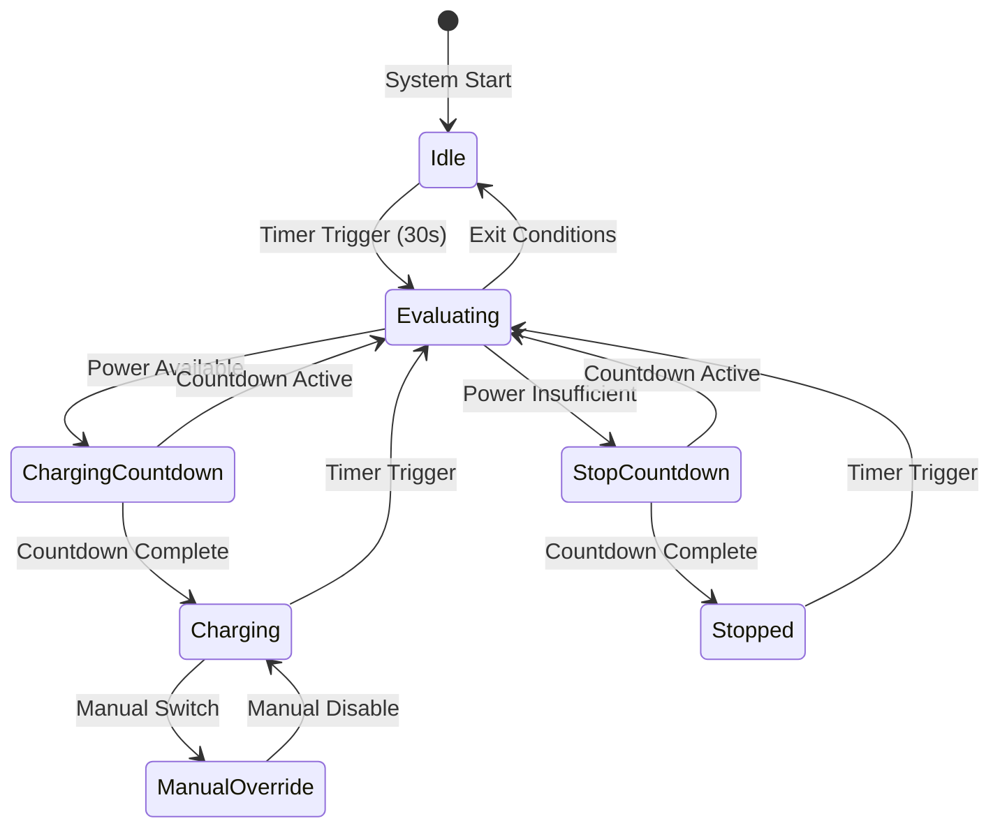

# Data Models & Structures

## Item Type Definitions

### Power Measurement Types
```
Number:Power - Power values in Watts (W)
├── Production_Power     - Solar production [W]
├── Grid_Power          - Grid import/export [W] (negative = export)
├── Load_Power          - Household consumption [W]
├── GoEChargerPowerAll  - Total charging power [W]
└── GoEChargerPowerL1/L2/L3 - Per-phase charging power [W]
```

### Energy Measurement Types
```
Number:Energy - Energy values in kilowatt-hours (kWh)
├── Day_Energy                    - Daily solar production [kWh]
├── Total_Energy                  - Lifetime solar production [kWh]
├── Year_Energy                   - Yearly solar production [kWh]
├── GoEChargerSessionChargedEnergy - Current session energy [kWh]
└── GoEChargerTotalChargedEnergy  - Lifetime charging energy [kWh]
```

### Electrical Measurement Types
```
Number:ElectricCurrent - Current values in Amperes (A)
├── GoEChargerMaxCurrent      - Charging current limit [A]
├── GoEChargerCurrentL1/L2/L3 - Per-phase current [A]
└── GoEChargerCableCurrent    - Cable rating [A]

Number:ElectricPotential - Voltage values in Volts (V)
├── GoEChargerVoltageL1/L2/L3 - Per-phase voltage [V]

Number:Temperature - Temperature in Celsius (°C)
├── GoEChargerTemperatureType2Port    - Connector temperature [°C]
└── GoEChargerTemperatureCircuitBoard - Internal temperature [°C]
```

### Dimensionless Types
```
Number:Dimensionless - Percentage and ratio values
├── Power_Autonomy        - Energy independence [%]
└── Power_SelfConsumption - Self-consumption rate [%]
```

## State Value Enumerations

### Go-E Charger PWM Signal States
```javascript
"READY_NO_CAR"    // No vehicle connected
"IDLE"            // Vehicle connected, not charging
"CHARGING"        // Active charging
"FINISHED"        // Charging completed
"ERROR"           // Error state
UNDEF             // Undefined/disconnected
```

### Go-E Charger Force States
```javascript
0  // Neutral (automatic control)
1  // Force OFF (charging disabled)
2  // Force ON (charging enabled)
```

### Go-E Charger Phase Configuration
```javascript
1  // Single-phase charging
3  // Three-phase charging
```

### System Control States
```javascript
// Switch states
ON   // Feature enabled
OFF  // Feature disabled

// Countdown states (Number)
0    // No countdown active
1-N  // Countdown cycles remaining
```

## Data Flow Models

### Power Calculation Model


### Current Calculation Model
```javascript
// Formula: I = P / (V × phases)
calculatedCurrent = availablePower / (voltagePerPhase × currentPhases)
targetCurrent = Math.min(Math.max(calculatedCurrent, minCurrent), maxCurrent)

// Example with 2500W available, 1-phase:
// targetCurrent = Math.min(Math.max(2500/230, 6), 16) = 10.87A → 10A
```

### State Transition Model


## Item State Persistence

### Timestamp Management
```javascript
// DateTime items for state tracking
LastStateChangeTime    // Tracks charging state changes
LastPhaseChangeTime    // Tracks phase switching events

// Usage pattern
val ZonedDateTime currentTime = ZonedDateTime.now()
val ZonedDateTime lastChange = (LastStateChangeTime.state as DateTimeType).getZonedDateTime()
val Integer secondsElapsed = Duration.between(lastChange, currentTime).toSeconds().intValue()
```

### Countdown Timer States
```javascript
// Countdown item patterns
ChargingStopCountdown   // Cycles before stopping charging
ChargingStartCountdown  // Cycles before starting charging  
PhaseChangeCountdown    // Cycles before phase switching

// State transitions
0 → N    // Start countdown (N = configured cycles)
N → N-1  // Decrement each cycle
1 → 0    // Execute action and reset
```

## Configuration Data Structures

### System Constants
```javascript
// Current limits
val int minCurrent = 6                    // Minimum safe current [A]
val int maxCurrent = 16                   // Maximum current limit [A]

// Power thresholds  
val int singlePhasePowerLimit = 1380      // 6A × 230V threshold [W]
val int threePhasePowerLimit = 4140       // 6A × 230V × 3 phases [W]

// Hysteresis values
val int powerHysteresis = 200             // Phase switching stability [W]
val int currentHysteresis = 1             // Current adjustment threshold [A]

// Timing controls
val int minTimeBetweenChanges = 30        // State change interval [s]
val int minTimeBetweenPhaseChanges = 500  // Phase change interval [s]

// Countdown configurations
val int chargingStopCountdownStart = 4    // 2 minutes (4 × 30s cycles)
val int chargingStartCountdownStart = 4   // 2 minutes
val int phaseChangeCountdownStart = 6     // 3 minutes
```

### Hardware Configuration
```javascript
// Physical constants
val int voltagePerPhase = 230             // European standard voltage [V]

// Notification settings
val String notificationEmail = "user@domain.com"  // Alert recipient
```

## Data Validation Models

### Input Validation Rules
```javascript
// State validation
if (GoEChargerPwmSignal.state == UNDEF || 
    GoEChargerPwmSignal.state == "READY_NO_CAR" || 
    GoEChargerPwmSignal.state == "IDLE") {
    return  // Invalid state for charging
}

// Mode validation
if (ExcessCharging.state != ON) {
    return  // Excess charging disabled
}
```

### Boundary Checking
```javascript
// Current limits enforcement
val int targetCurrent = Math.min(
    Math.max(calculatedCurrent, minCurrent),  // Lower bound: 6A
    maxCurrent                                // Upper bound: 16A
)

// Phase validation
val int currentPhases = (GoEChargerPhases.state as Number).intValue
// Valid values: 1 or 3 only
```

### Null State Handling
```javascript
// Initialize undefined items
if (LastStateChangeTime.state === NULL) {
    LastStateChangeTime.postUpdate(new DateTimeType())
}

if (ChargingStopCountdown.state === NULL) {
    ChargingStopCountdown.postUpdate(0)
}
```

## Performance Data Models

### Execution Metrics
- **Rule Frequency:** 30-second intervals
- **State Persistence:** All states maintained across restarts
- **Memory Usage:** Minimal (item states only)
- **Processing Time:** Sub-second execution per cycle

### Historical Data Patterns
- **Power Group:** `gPower` items logged for charting
- **Energy Tracking:** Session and total energy accumulation
- **State History:** Timestamp tracking for all major changes
