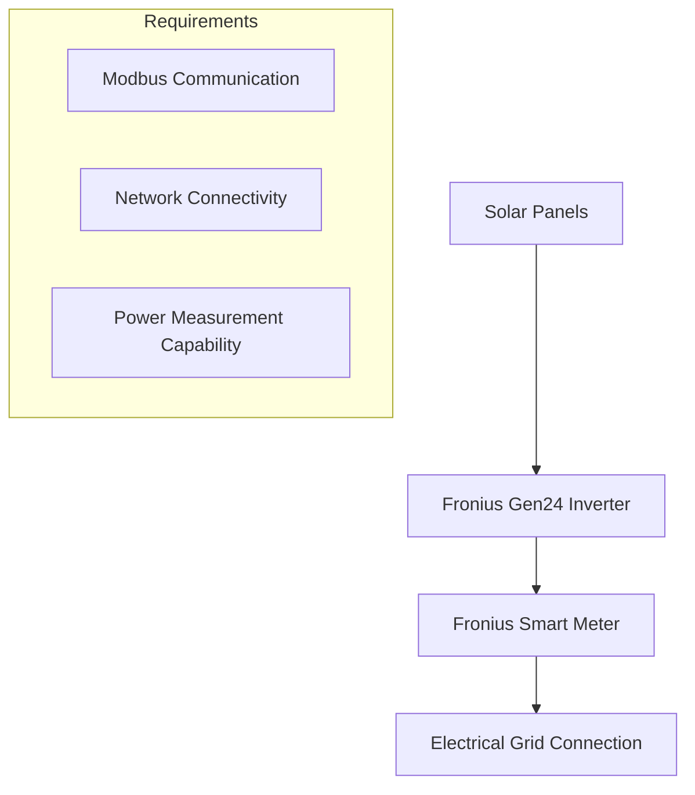
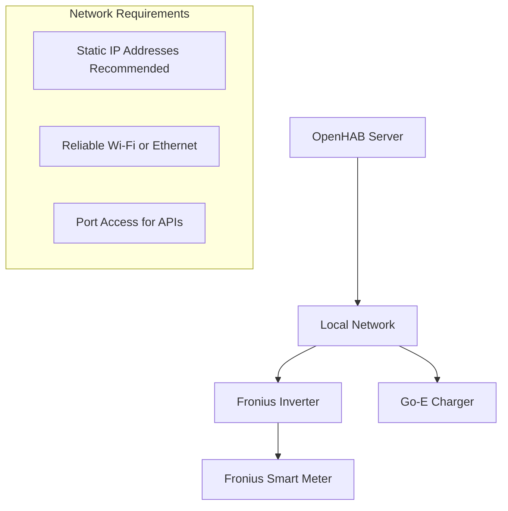

# Dependencies & Requirements

## OpenHAB Platform Requirements

### Core Platform
- **OpenHAB Version:** 4.x (minimum)
- **Java Runtime:** OpenJDK 17+ (recommended by OpenHAB 4)
- **Operating System:** Linux, Windows, or macOS
- **Memory:** Minimum 1GB RAM (2GB+ recommended)
- **Storage:** 500MB+ free space for installation and logs

### Required OpenHAB Services
- **Rules Engine:** For automation logic execution
- **Items Registry:** For device state management  
- **Things Framework:** For hardware binding integration
- **Scheduler Service:** For cron-based rule triggers
- **Notification Service:** For email alerts

## Hardware Dependencies

### Solar Power System


#### Fronius Gen24 Inverter
- **Model:** Fronius Gen24 series (any size)
- **Firmware:** Latest stable version recommended
- **Network:** Ethernet or Wi-Fi connectivity
- **API Access:** HTTP/JSON API enabled
- **Modbus:** RTU or TCP support for meter integration

#### Fronius Smart Meter
- **Model:** Fronius Smart Meter 63A-3 or 65A-3
- **Connection:** Modbus RTU to inverter
- **Installation:** Grid connection point measurement
- **Configuration:** Proper CT orientation for import/export detection

### EV Charging Infrastructure

#### Go-E Genesis Wallbox
- **Model:** Go-E Charger Genesis (11kW or 22kW)
- **Network:** Ethernet or Wi-Fi connectivity
- **API:** HTTP/JSON API access enabled
- **Installation:** Proper electrical installation with RCD protection
- **Features Required:**
  - Dynamic current adjustment (6-16A)
  - Phase switching capability (1-phase/3-phase)
  - Remote control via API

#### Electrical Installation
- **Circuit Protection:** Appropriate MCB and RCD
- **Cable Rating:** Suitable for maximum charging current
- **Earthing:** Proper protective earth connection
- **Phase Configuration:** Support for both 1-phase and 3-phase operation

## OpenHAB Binding Dependencies

### Fronius Binding
**Installation:**
```bash
# Via OpenHAB UI
Settings → Add-ons → Bindings → Search "Fronius" → Install

# Via Karaf console
openhab> bundle:install mvn:org.openhab.binding/org.openhab.binding.fronius
```

**Configuration Requirements:**
- Inverter IP address and network access
- Refresh interval configuration (recommended: 5 seconds)
- Device ID mapping for multiple inverters/meters

**Supported Channels:**
- Power flow data (grid, load, PV)
- Energy measurements (daily, total, yearly)
- Device status and error codes
- Meter data (per-phase measurements)

### Go-E Charger Binding
**Installation:**
```bash
# Via OpenHAB UI  
Settings → Add-ons → Bindings → Search "Go-E" → Install

# Via Karaf console
openhab> bundle:install mvn:org.openhab.binding/org.openhab.binding.goecharger
```

**Configuration Requirements:**
- Wallbox IP address and network access
- Refresh interval configuration (recommended: 10 seconds)
- API access credentials if authentication enabled

**Supported Channels:**
- Charging control (current, phases, force state)
- Power and energy measurements
- Status monitoring (car state, errors, temperature)
- Session management

## Network Requirements

### Network Topology


### Connectivity Requirements
- **Bandwidth:** Minimal (< 1 Mbps for all devices)
- **Latency:** Low latency preferred for responsive control
- **Reliability:** Stable network connection essential
- **Security:** Secure local network (WPA3 recommended)

### Port Requirements
- **Fronius Inverter:** HTTP port 80 (default)
- **Go-E Charger:** HTTP port 80 (default)
- **OpenHAB:** Port 8080 (web interface), 8443 (HTTPS)

## Software Dependencies

### OpenHAB Add-ons
```yaml
Required Bindings:
  - org.openhab.binding.fronius
  - org.openhab.binding.goecharger

Optional Add-ons:
  - org.openhab.persistence.mysql (for data logging)
  - org.openhab.ui.basic (for simple web interface)
  - org.openhab.transformation.map (for value mapping)
```

### System Services
- **Email Service:** SMTP server access for notifications
- **Time Synchronization:** NTP for accurate timestamps
- **Logging Service:** For system monitoring and troubleshooting

## Configuration File Dependencies

### Required Configuration Files
```
conf/
├── items/
│   └── solar.items          # Item definitions
├── rules/
│   └── solar.rules          # Automation logic
├── things/
│   └── fronius.things       # Hardware thing definitions
│   └── goecharger.things    # Wallbox thing definitions
└── services/
    └── mail.cfg             # Email notification config
```

### Thing Configuration Example
```javascript
// fronius.things
Bridge fronius:bridge:mybridge [ hostname="192.168.1.100", refreshInterval=5 ] {
    Thing powerinverter myinverter [ deviceId=1 ]
    Thing meter mymeter [ deviceId=0 ]
}

// goecharger.things  
Thing goecharger:goe:garage [ ip="192.168.1.101", refreshInterval=10 ]
```

## Runtime Dependencies

### Java Libraries
- **OpenHAB Core:** Provided by platform
- **Binding Libraries:** Automatically managed
- **HTTP Client:** For API communication
- **JSON Parser:** For data processing
- **Cron Scheduler:** For timer-based execution

### System Resources
- **CPU Usage:** Low (< 5% on modern hardware)
- **Memory Usage:** ~50MB for rules and bindings
- **Disk I/O:** Minimal (logging and persistence only)
- **Network I/O:** Low bandwidth, frequent small requests

## Optional Dependencies

### Data Persistence
```yaml
MySQL/MariaDB:
  - For historical data storage
  - Chart generation capability
  - Long-term trend analysis

InfluxDB:
  - Time-series data optimization
  - Grafana integration
  - Advanced analytics
```

### Monitoring and Alerting
```yaml
Grafana:
  - Advanced visualization
  - Custom dashboards
  - Alert management

Telegram Bot:
  - Alternative notification channel
  - Mobile-friendly alerts
  - Interactive commands
```

### Home Assistant Integration
```yaml
MQTT Broker:
  - Cross-platform integration
  - Home Assistant connectivity
  - IoT device integration

openHAB Cloud Connector:
  - Remote access capability
  - Mobile app integration
  - Voice control support
```

## Version Compatibility

### Tested Versions
- **OpenHAB:** 4.0.x, 4.1.x, 4.2.x
- **Fronius Binding:** 4.0+ compatible versions
- **Go-E Binding:** 4.0+ compatible versions
- **Java:** OpenJDK 17, 21

### Compatibility Notes
- Fronius API compatibility across Gen24 firmware versions
- Go-E Charger API stability across firmware updates
- OpenHAB binding backward compatibility considerations

## Installation Dependencies

### Pre-installation Requirements
1. **Hardware Setup:** All devices installed and networked
2. **Network Configuration:** Static IPs assigned
3. **OpenHAB Installation:** Platform installed and running
4. **Binding Installation:** Required bindings installed
5. **Configuration Files:** Items and things configured
6. **Testing:** Individual device connectivity verified

### Post-installation Validation
1. **Item States:** All items receiving valid data
2. **Rule Execution:** Automation logic functioning
3. **Notifications:** Email alerts working
4. **Safety Testing:** Emergency stop procedures verified
