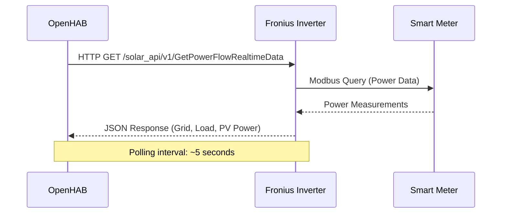
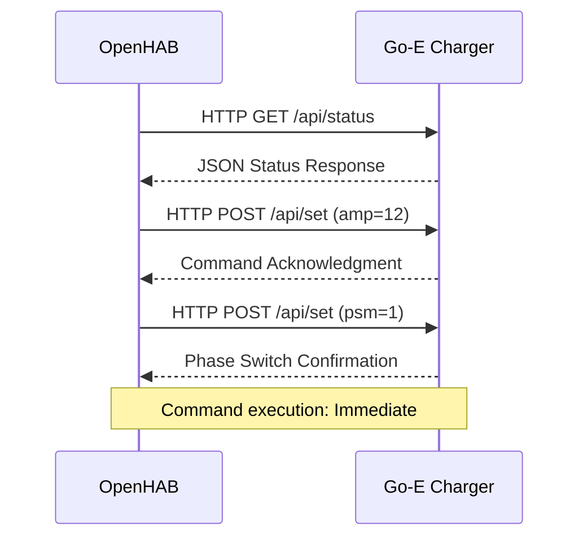

# Interfaces & Integration Points

## Hardware Interfaces

### Fronius Gen24 Inverter Interface
**Binding:** `fronius:powerinverter`  
**Protocol:** HTTP/JSON API  
**Bridge Configuration:** `mybridge:myinverter`

#### Power Flow Channels
- `powerflowchannelpgrid` - Grid power (import/export)
- `powerflowchannelpload` - Load power (consumption)
- `powerflowchannelppv` - PV power (solar production)
- `powerflowautonomy` - Energy autonomy percentage
- `powerflowselfconsumption` - Self-consumption rate

#### Inverter Data Channels
- `inverterdatachannelpac` - AC power output
- `inverterdatachanneldayenergy` - Daily energy production
- `inverterdatachanneltotal` - Total lifetime energy
- `inverterdatachannelyear` - Yearly energy production

#### Status Channels
- `inverterdatadevicestatuserrorcode` - Error codes
- `inverterdatadevicestatusstatuscode` - Status codes

### Fronius Smart Meter Interface
**Binding:** `fronius:meter`  
**Protocol:** Modbus via Fronius inverter  
**Bridge Configuration:** `mybridge:mymeter`

#### Power Measurement Channels
- `powerrealphase1/2/3` - Real power per phase
- `powerrealsum` - Total real power sum

#### Energy Measurement Channels
- `energyrealsumconsumed` - Total consumed energy
- `energyrealsumproduced` - Total produced energy

### Go-E Genesis Wallbox Interface
**Binding:** `goecharger:goe`  
**Protocol:** HTTP/JSON API  
**Thing Configuration:** `garage`

#### Control Channels
- `maxCurrent` - Maximum charging current (6-16A)
- `maxCurrentTemp` - Temporary current limit
- `forceState` - Force charging state (0=Auto, 1=Off, 2=On)
- `phases` - Number of charging phases (1 or 3)
- `transaction` - Access control state
- `allowCharging` - Charging permission

#### Monitoring Channels
- `pwmSignal` - Car connection status
- `error` - Error codes and messages
- `voltageL1/L2/L3` - Voltage per phase
- `currentL1/L2/L3` - Current per phase
- `powerL1/L2/L3` - Power per phase
- `powerAll` - Total charging power
- `sessionChargedEnergy` - Current session energy
- `totalChargedEnergy` - Lifetime charged energy

#### Status Channels
- `cableCurrent` - Cable current rating
- `temperatureType2Port` - Connector temperature
- `temperature` - Internal temperature
- `firmware` - Firmware version
- `accessConfiguration` - Access settings

## Communication Protocols

### Fronius Integration


### Go-E Charger Integration


## Data Exchange Formats

### Power Flow Data Structure
```json
{
  "Body": {
    "Data": {
      "Site": {
        "P_Grid": -1500.0,     // Negative = export to grid
        "P_Load": 2000.0,      // Household consumption
        "P_PV": 3500.0,        // Solar production
        "rel_Autonomy": 85.5,  // Energy independence %
        "rel_SelfConsumption": 57.1  // Self-consumption %
      }
    }
  }
}
```

### Go-E Charger Status
```json
{
  "amp": 16,           // Current limit (A)
  "psm": 1,           // Phase switch mode (1=1-phase, 2=3-phase)
  "frc": 0,           // Force state (0=neutral, 1=off, 2=on)
  "car": 3,           // Car state (1=ready, 2=charging, 3=waiting, 4=finished)
  "nrg": [230, 0, 0, 6, 0, 0, 0, 0, 0, 0, 1380, 0, 0, 0, 0, 0],
  "eto": 1234.5,      // Total energy (kWh)
  "wh": 15.2          // Session energy (kWh)
}
```

## API Integration Points

### OpenHAB Rules Engine Interface
```javascript
// Item state access
val Number gridPower = Grid_Power.state as Number
val Number chargerPower = GoEChargerPowerAll.state as Number

// Command sending
GoEChargerMaxCurrent.sendCommand(targetCurrent)
GoEChargerPhases.sendCommand(3)
GoEChargerForceState.sendCommand(0)

// State updates
AvailablePowerCharger.sendCommand(availablePower)
LastStateChangeTime.postUpdate(new DateTimeType())
```

### Notification Interface
```javascript
// Email notification
sendNotification(notificationEmail, messageText)

// Logging interface
logInfo("Excess Charging", "Message with {} placeholder", value)
```

## Configuration Interfaces

### Thing Configuration (things file)
```
Bridge fronius:bridge:mybridge [ hostname="192.168.1.100", refreshInterval=5 ] {
    Thing powerinverter myinverter [ deviceId=1 ]
    Thing meter mymeter [ deviceId=0 ]
}

Thing goecharger:goe:garage [ ip="192.168.1.101", refreshInterval=10 ]
```

### Item Binding Configuration
```
Number:Power Grid_Power { 
    channel="fronius:powerinverter:mybridge:myinverter:powerflowchannelpgrid" 
}

Number:ElectricCurrent GoEChargerMaxCurrent { 
    channel="goecharger:goe:garage:maxCurrent" 
}
```

## Error Handling Interfaces

### Fronius Error Codes
- Connection timeouts handled by binding
- Invalid responses logged and ignored
- Automatic reconnection on network issues

### Go-E Error Handling
- Command validation before sending
- Status verification after commands
- Error code interpretation and logging

### System Error Recovery
```javascript
// Null state handling
if (GoEChargerPwmSignal.state == UNDEF) {
    return  // Exit gracefully
}

// Item initialization
if (LastStateChangeTime.state === NULL) {
    LastStateChangeTime.postUpdate(new DateTimeType())
}
```

## Performance Considerations

### Polling Frequencies
- **Fronius Binding:** 5-second intervals
- **Go-E Binding:** 10-second intervals  
- **Rule Execution:** 30-second intervals

### Command Throttling
- Minimum 30 seconds between state changes
- Minimum 500 seconds between phase changes
- Countdown timers prevent rapid switching

### Network Resilience
- Automatic binding reconnection
- Graceful degradation on communication loss
- State persistence across restarts
