# Workflows & Logic Flows

## Main Excess Charging Workflow

### Primary Control Loop
**Trigger:** Every 30 seconds (`Time cron "*/30 * * * * ?"`)

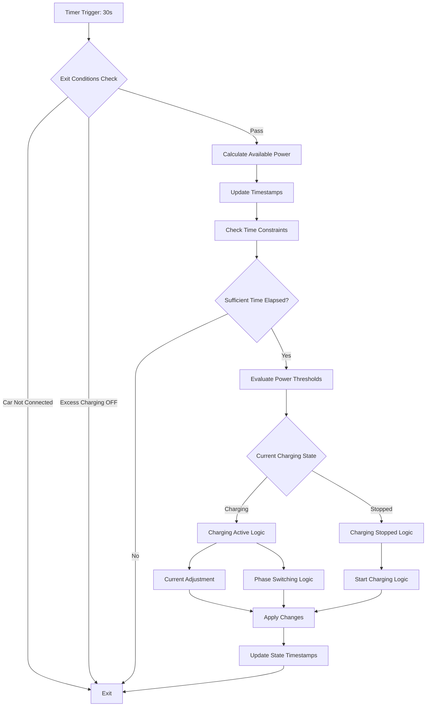

## Power Calculation Workflow

### Available Power Determination
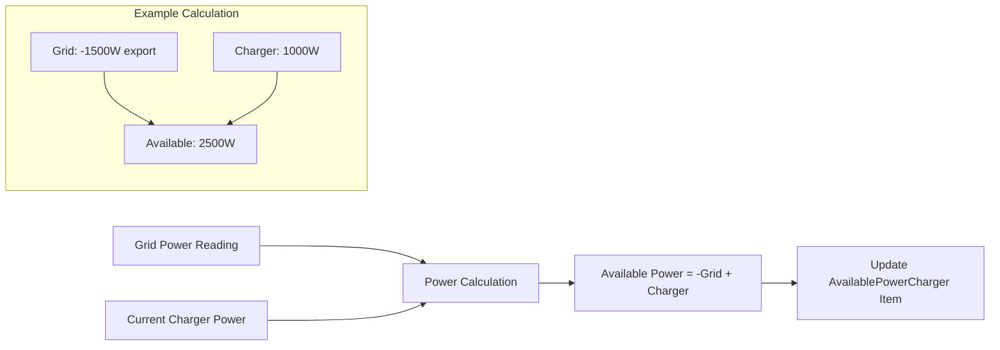

### Power Threshold Logic
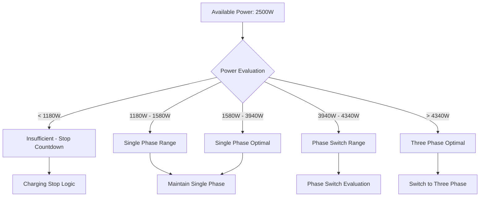

## Countdown Timer Workflows

### Charging Stop Countdown
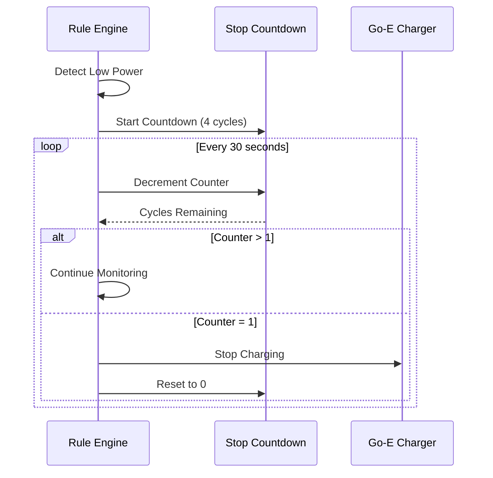

### Phase Change Countdown
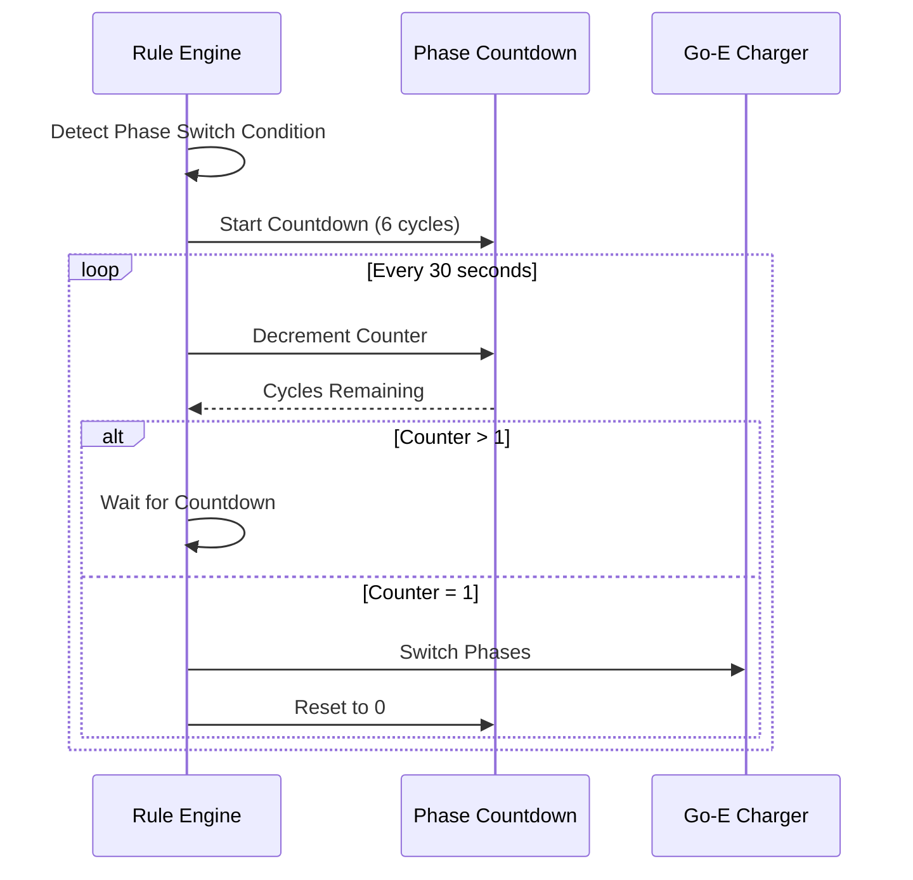

## Current Adjustment Workflow

### Dynamic Current Calculation
```mermaid
flowchart TD
    A[Available Power: 2500W] --> B[Get Current Phases]
    B --> C{Phase Count}
    C -->|1 Phase| D[Calculate: 2500W ÷ 230V = 10.87A]
    C -->|3 Phase| E[Calculate: 2500W ÷ (230V × 3) = 3.62A]
    
    D --> F[Apply Limits: min(max(10.87, 6), 16) = 10A]
    E --> G[Apply Limits: min(max(3.62, 6), 16) = 6A]
    
    F --> H{Current Change > 1A?}
    G --> H
    H -->|Yes| I[Send New Current Command]
    H -->|No| J[No Change Needed]
```

### Current Hysteresis Logic
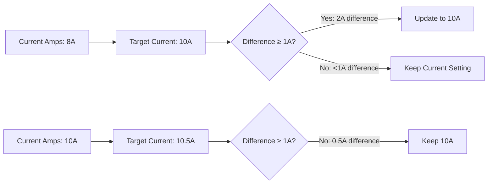

## Phase Switching Workflow

### Single to Three Phase Transition


### Three to Single Phase Transition
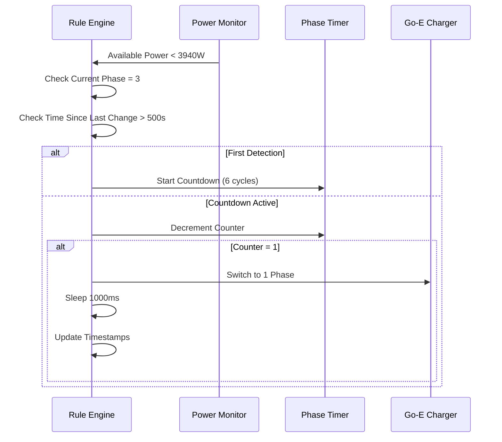

## Manual Override Workflow

### Manual Charging Control
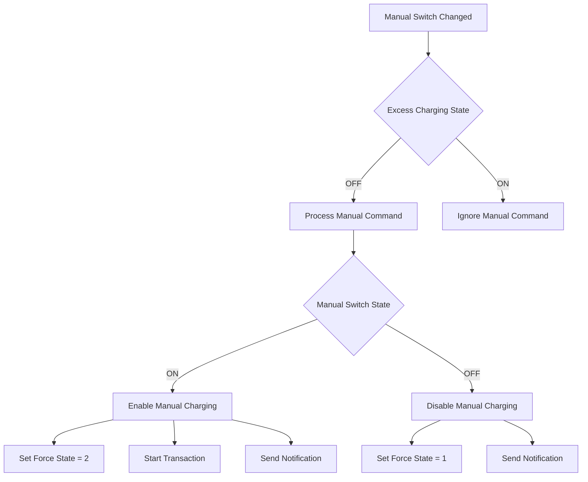

## Error Handling Workflows

### System State Validation
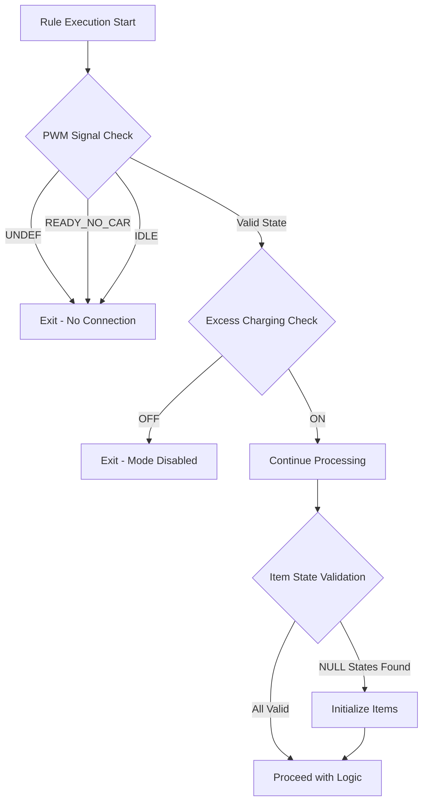

### Timestamp Initialization Workflow
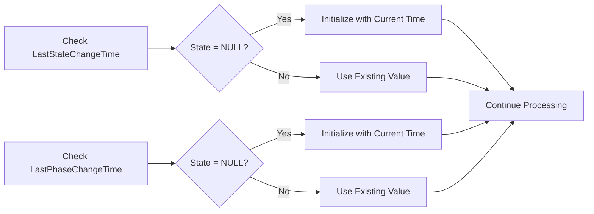

## Notification Workflows

### State Change Notifications
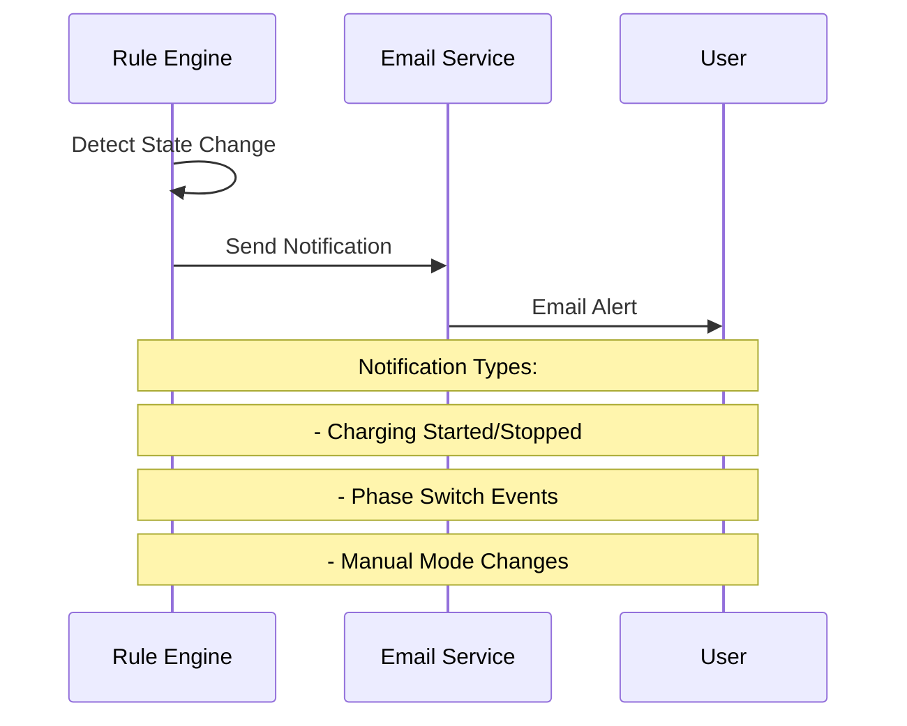

## Performance Optimization Workflows

### Execution Efficiency
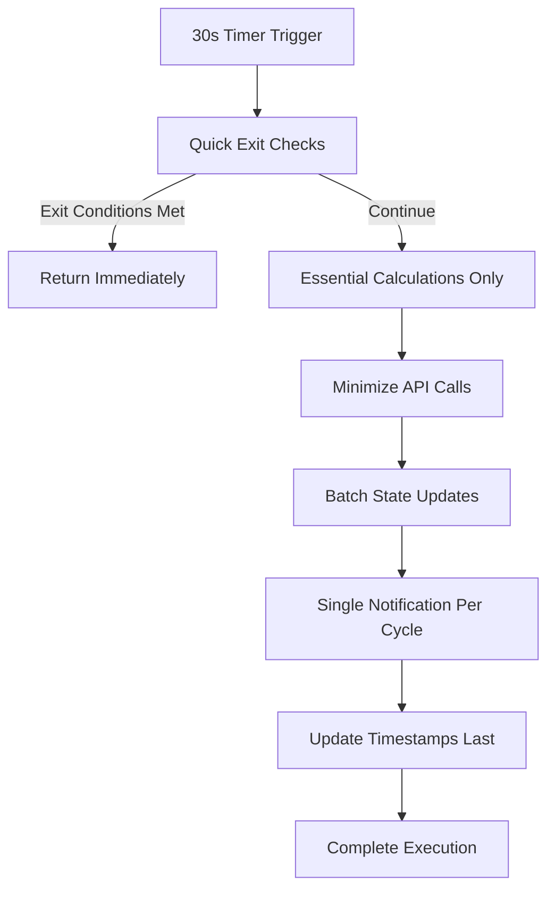

### State Change Throttling
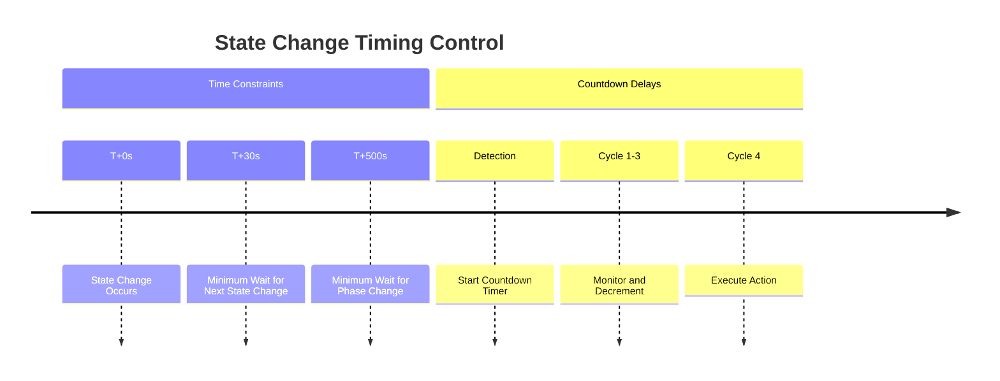
