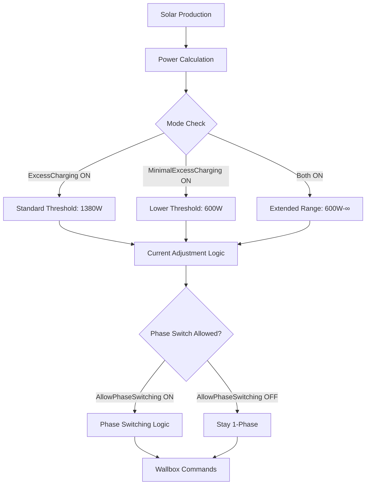
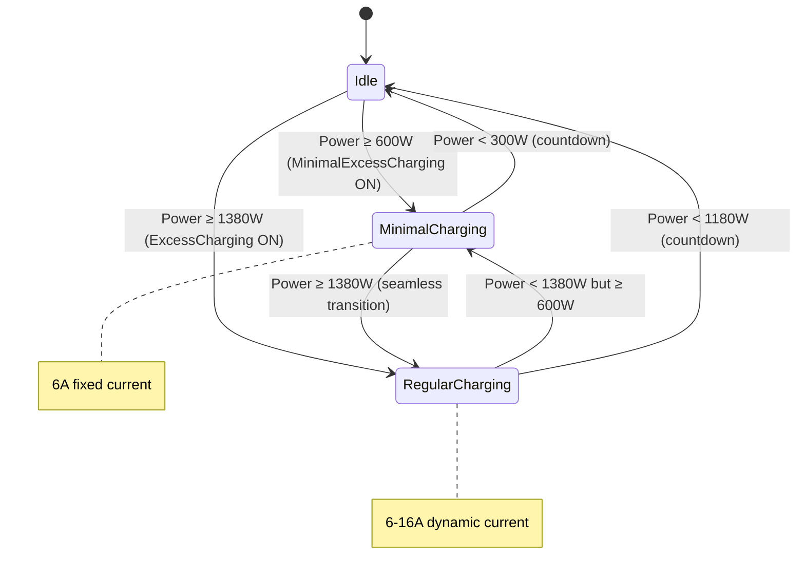

# Detailed Design: Minimal Excess Charging Feature

## Overview

This design extends the existing OpenHAB solar excess charging system with a "Minimal Excess Charging" mode that enables EV charging at lower solar production levels (600W threshold instead of 1380W). The feature also adds a global phase switching control that affects all charging modes.

## Detailed Requirements

### Functional Requirements
1. **Minimal Excess Charging Mode**
   - Start charging at 600W solar production
   - Stop charging at 300W solar production (300W hysteresis)
   - Charge at 6A between 600W-1380W range
   - Seamlessly transition to dynamic current adjustment above 1380W
   - Use same countdown timers as existing excess charging (4 cycles start/stop, 6 cycles phase change)

2. **Global Phase Switching Control**
   - Switch to enable/disable automatic phase switching for all modes
   - When disabled, system stays in 1-phase only
   - Default state: enabled (allows phase switching)
   - Affects both regular and minimal excess charging modes

3. **Mode Integration**
   - Works as extension of existing excess charging
   - When both ExcessCharging and MinimalExcessCharging enabled: extends effective range down to 600W
   - Maintains all existing functionality (manual override, notifications, safety features)

### Non-Functional Requirements
- **Simplicity**: Minimal code changes to existing system
- **Reliability**: Reuse existing stability mechanisms
- **Maintainability**: Single rule modification, no duplicate logic

## Architecture Overview



## Components and Interfaces

### New Items (solar.items)
```
Switch MinimalExcessCharging       "Minimal Überschussladen"
Switch AllowPhaseSwitching         "Phasenumschaltung erlauben"
```

### Modified Rule Logic
The existing "Excess Charging Control" rule will be extended with:

#### 1. Updated Exit Condition
```javascript
// Replace existing exit condition
if (GoEChargerPwmSignal.state == UNDEF || 
    GoEChargerPwmSignal.state == "READY_NO_CAR" || 
    GoEChargerPwmSignal.state == "IDLE" ||
    (ExcessCharging.state != ON && MinimalExcessCharging.state != ON)) {
    return
}
```

#### 2. Dynamic Threshold Configuration
```javascript
// Add after existing configuration constants
val int minimalChargingStartThreshold = 600
val int minimalChargingStopThreshold = 300

// Determine effective thresholds based on active modes
val boolean minimalModeActive = MinimalExcessCharging.state == ON
val int effectiveStartThreshold = if (minimalModeActive) minimalChargingStartThreshold else singlePhasePowerLimit
val int effectiveStopThreshold = if (minimalModeActive) minimalChargingStopThreshold else (singlePhasePowerLimit - powerHysteresis)
```

#### 3. Modified Power Evaluation Logic
```javascript
// Replace hardcoded threshold checks with dynamic thresholds
if (availablePower < effectiveStopThreshold && 
    secondsSinceLastStateChange >= minTimeBetweenChanges) {
    // existing stop countdown logic
}

// For charging start logic
if (availablePower >= effectiveStartThreshold) {
    // existing start countdown logic  
}
```

#### 4. Phase Switching Control
```javascript
// Wrap existing phase switching logic
if (AllowPhaseSwitching.state == ON && secondsSinceLastPhaseChange >= minTimeBetweenPhaseChanges) {
    // existing phase switching logic (1-phase ↔ 3-phase)
}
```

## Data Models

### Power Thresholds
```
Regular Excess Charging:    1380W start / 1180W stop (200W hysteresis)
Minimal Excess Charging:    600W start / 300W stop (300W hysteresis)
Combined Mode:              600W start / 300W stop (extends range)
```

### Current Behavior
```
600W - 1380W:   6A (minimal mode)
1380W+:         Dynamic 6-16A (regular excess charging logic)
```

### State Transitions


## Error Handling

### Existing Safety Mechanisms (Reused)
- Countdown timers prevent rapid switching
- Input validation for car connection status
- Boundary checking for current limits (6-16A)
- Time-based change restrictions

### New Safety Considerations
- **Mode Conflict**: Both modes can be enabled simultaneously (by design)
- **Phase Control**: Global switch overrides all automatic phase switching
- **Threshold Validation**: 600W and 300W thresholds are within safe operating range

## Testing Strategy

### Unit Testing Approach
1. **Threshold Testing**
   - Test 600W start threshold with countdown
   - Test 300W stop threshold with countdown
   - Test seamless transition at 1380W boundary

2. **Mode Interaction Testing**
   - Test MinimalExcessCharging alone
   - Test ExcessCharging alone  
   - Test both modes enabled (extended range)
   - Test with Manual mode override

3. **Phase Control Testing**
   - Test AllowPhaseSwitching ON (normal behavior)
   - Test AllowPhaseSwitching OFF (1-phase only)
   - Test phase control with both charging modes

4. **Integration Testing**
   - Test with actual hardware setup
   - Validate power calculations with real solar data
   - Test countdown timer behavior
   - Verify notification system works

### Safety Testing
- Emergency stop scenarios
- Power calculation accuracy validation
- Current limit enforcement verification
- Phase switching stability testing

## Appendices

### Technology Choices
- **Implementation**: Extend existing OpenHAB Rules DSL rule
- **Rationale**: Minimal changes, reuse existing infrastructure, single maintenance point

### Research Findings
- Existing rule structure is ideal for extension
- Configuration constants pattern allows easy threshold management
- Countdown timer system provides proven stability
- Single rule approach prevents code duplication

### Alternative Approaches Considered
1. **Separate Rule**: Would duplicate logic and complicate maintenance
2. **New Binding**: Overkill for simple threshold modification
3. **External Script**: Would lose integration with existing safety systems

### Key Constraints
- Must maintain existing functionality unchanged
- Must reuse existing safety and stability mechanisms
- Must integrate seamlessly with current user interface patterns
- Must be simple to configure and maintain
