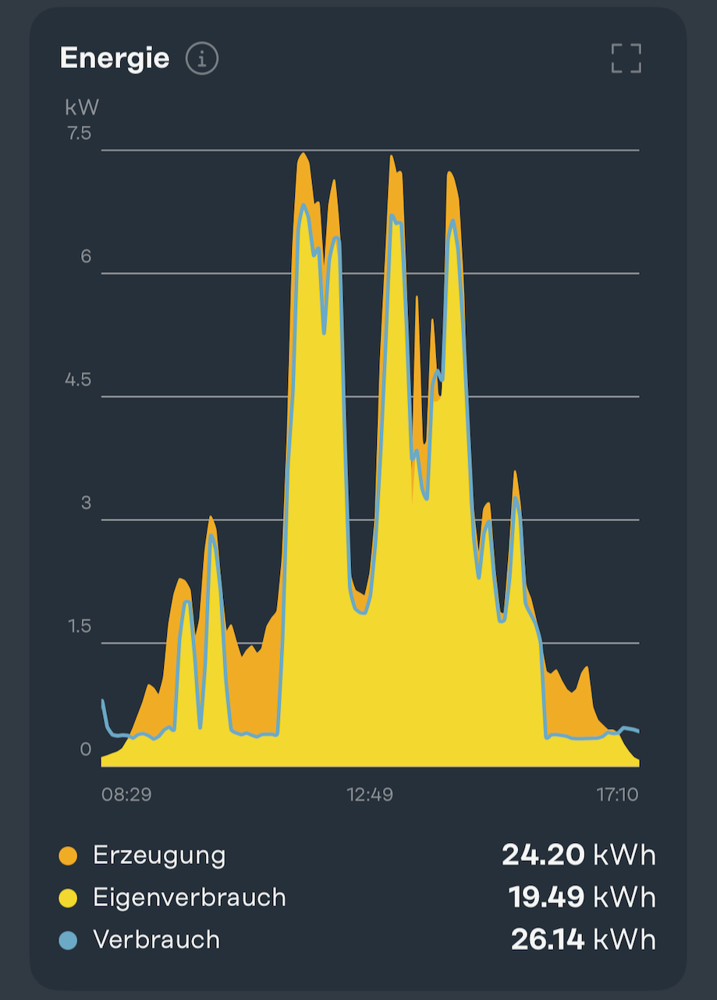

# Solar Excess Charging Control Rule for OpenHAB 4

## Introduction

This project implements an intelligent excess charging control system for electric vehicles, integrating OpenHAB 4 with a Go-E Genesis wallbox and a Fronius Gen24 inverter in conjunction with a Fronius Smart Meter (interconnected via Modbus). The system optimizes electric vehicle charging by utilizing surplus solar power, maximizing self-consumption while minimizing grid dependency.

## System Overview



### Real-World Performance

The following diagrams demonstrate the system's operation in practice:

 

Solar production (orange) and charging correlation demonstrating optimized self-consumption (yellow).

## Key Features

- Dynamic charging current adjustment based on available solar power
- Intelligent switching between 1-phase and 3-phase charging
- **Minimal excess charging mode** - Utilizes low solar production (600W threshold)
- **Global phase switching control** - Enable/disable automatic phase switching
- Advanced stability control mechanisms
- Manual charging override option
- Real-time monitoring and notifications

## Quick Start

### Prerequisites
- OpenHAB 4 installation
- Go-E Genesis wallbox
- Fronius Gen24 inverter with Smart Meter
- Network connectivity between all devices

### Installation

1. **Install Required Bindings**
   ```
   Go-E Charger binding
   Fronius binding
   ```

2. **Configure Hardware**
   ```bash
   # Copy and customize thing configurations
   cp conf/things/fronius.things.example conf/things/fronius.things
   cp conf/things/goecharger.things.example conf/things/goecharger.things
   
   # Update IP addresses in thing files
   ```

3. **Deploy Configuration**
   ```bash
   # Copy to your OpenHAB installation
   cp conf/items/solar.items /etc/openhab/items/
   cp conf/rules/solar.rules /etc/openhab/rules/
   cp conf/things/*.things /etc/openhab/things/
   ```

4. **Configure Notifications**
   - Update email address in `conf/rules/solar.rules`
   - Configure SMTP settings in OpenHAB

## Project Structure

```
├── conf/                    # OpenHAB configuration files
│   ├── items/              # Item definitions
│   ├── rules/              # Automation rules
│   ├── things/             # Hardware configurations
│   └── services/           # Service configurations
├── docs/                   # Documentation and diagrams
│   └── images/            # System diagrams and charts
├── examples/              # Example configurations
├── tests/                 # Test procedures
├── .sop/summary/          # Comprehensive system documentation
├── CONTRIBUTING.md        # Development guidelines
├── ROADMAP.md            # Future development plans
└── README.md             # This file
```

## Documentation

For comprehensive system documentation, see [.sop/summary/index.md](.sop/summary/index.md) which provides:
- Complete system architecture
- Component details and workflows
- Hardware interface specifications
- Configuration guidance
- Troubleshooting information

## Configuration

Key configurable parameters in `conf/rules/solar.rules`:
- Charging current limits (6-16A)
- Phase switching thresholds
- **Minimal charging thresholds (600W start / 300W stop)**
- Hysteresis values
- Timer durations
- Notification settings

### New Control Items
- `ExcessCharging` - Standard excess charging mode (1380W threshold)
- `MinimalExcessCharging` - Winter/low solar mode (600W threshold)  
- `AllowPhaseSwitching` - Global phase switching control
- `ManuellLaden` - Manual charging override

## Contributing

See [CONTRIBUTING.md](CONTRIBUTING.md) for development setup, coding standards, and contribution guidelines.

## Roadmap

See [ROADMAP.md](ROADMAP.md) for planned features and development timeline.

## License

This project is open source. Please ensure compliance with OpenHAB and hardware manufacturer licensing terms.

## Support

For issues and questions:
1. Check the comprehensive documentation in `.sop/summary/`
2. Review troubleshooting guides
3. Open an issue with detailed system information


