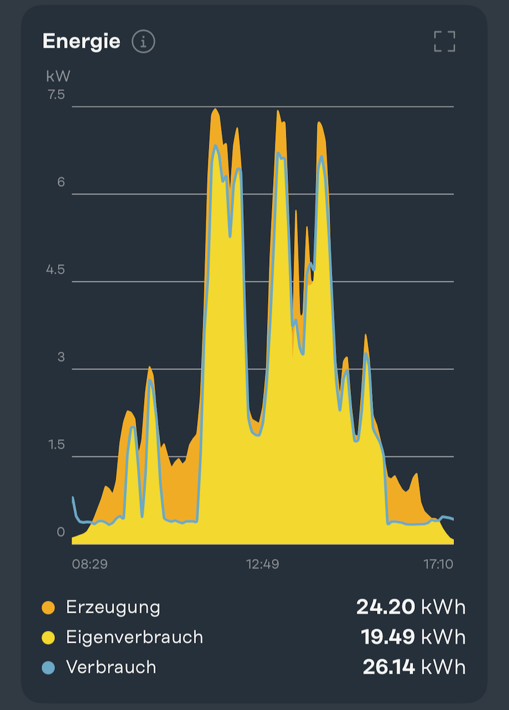
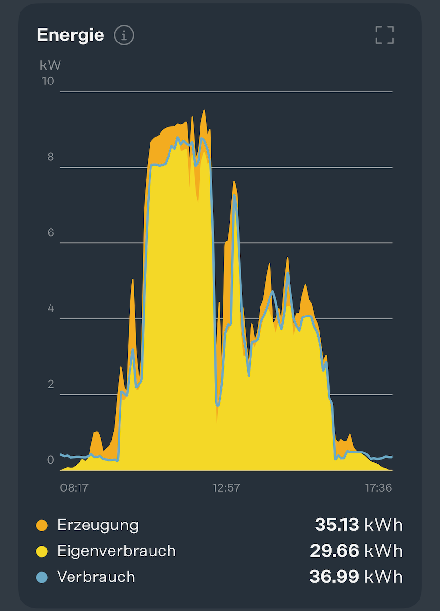

# Solar Excess Charging Control Rule for Openhab 4

## Introduction

This project implements an intelligent excess charging control system for electric vehicles, integrating OpenHAB 4 with a Go-E Genesis wallbox and a Fronius Gen24 inverter in conjunction with a Fronius Smart Meter (interconnected via Modbus). The system optimizes electric vehicle charging by utilizing surplus solar power, maximizing self-consumption while minimizing grid dependency.

Excess charging refers to the intelligent use of surplus solar energy for charging electric vehicles. When solar production exceeds household consumption, the system automatically directs this excess power to vehicle charging, ensuring optimal use of renewable energy and reducing electricity costs.

## System Overview



### Real-World Performance

The following diagrams demonstrate the system's operation in practice:

 

Solar production (orange) and charging correlation demonstrating optimized self-consumption (yellow).

## Key Features

- Dynamic charging current adjustment based on available solar power
- Intelligent switching between 1-phase and 3-phase charging
- Advanced stability control mechanisms
- Manual charging override option
- Real-time monitoring and notifications

## Technical Solutions

The system implements several sophisticated control mechanisms to ensure stable and efficient operation:

### 1. Stability Control
- Power and current hysteresis to prevent oscillation
- Countdown timers for major state changes
- Minimum time intervals between switching operations

### 2. Charging Optimization
- Automatic phase switching (1-phase/3-phase) based on available power
- Dynamic current adjustment within safe limits
- Configurable power thresholds and safety margins

### 3. Safety Features
- Comprehensive system state monitoring
- Fail-safe operation modes
- Automatic error detection and handling

## Configuration Parameters
Key configurable parameters include:
- Charging current limits (6-16A)
- Phase switching thresholds
- Hysteresis values
- Timer durations
- Notification settings

## System Requirements
- OpenHAB 4 installation
- Go-E Genesis wallbox
- Fronius Gen24 inverter
- Required OpenHAB plugins:
  - [Go-E Charger binding](https://www.openhab.org/addons/bindings/goecharger/)
  - [Fronius binding](https://www.openhab.org/addons/bindings/fronius/)

## Installation

### Install Required Bindings
1. Open OpenHAB settings
2. Navigate to Settings → Things → Install
3. Search and install:
    Go-E Charger binding
    Fronius binding

### Configure Items
Copy the provided items file content to your OpenHAB items configuration
The items file includes all necessary definitions for:
- Fronius inverter measurements
- Go-E charger controls

### Add Rule
1. Copy the provided rule file to your OpenHAB rules directory
2. Verify that all item references match your configuration

--> The rule implements:
    - Excess charging control logic
    - Phase switching
    - Safety timers
    - Manual control options

### Configure Sitemap

Add the following to your sitemap configuration:

```
Text item=Production_Power label="PV-Anlage [%.0f W]" icon="solarplant" {
            Text item=Production_Power icon=solarplant
            Text item=Meter_PowerSum icon=energy

            Switch item=Chart_Interval label="Leistungsverlauf" icon="line" mappings=[0="Stunde", 1="Tag", 2="Woche"]
            Chart item=gPower period=h refresh=60 service="mysql" visibility=[Chart_Interval==0]
            Chart item=gPower period=D refresh=300 service="mysql" visibility=[Chart_Interval==1, Chart_Interval=="Uninitialized"]
            Chart item=gPower period=W refresh=1800 service="mysql" visibility=[Chart_Interval==2]
            
}

Text item=GoEChargerPowerAll label="Wallbox" icon="battery" {


            Switch item=ManuellLaden
            Switch item=ExcessCharging
            Text item=AvailablePowerCharger label="Verfügbar für Wallbox [%.0f W]" icon=energy
            Text item=GoEChargerPowerAll icon=energy
            Setpoint item=GoEChargerMaxCurrent label="Strombegrenzung [%s]" icon=poweroutlet_eu minValue=6 maxValue=16 step=1
            Setpoint item=GoEChargerPhases icon=poweroutlet_eu minValue=1 maxValue=3 step=2
            Text item=GoEChargerSessionChargedEnergy icon=battery
            Text item=GoEChargerPwmSignal label="PWM vom Auto" icon=text
            Text item=GoEChargerError icon=text
            Text label="Details" icon="settings" {
                Text item=GoEChargerCurrentL1 icon=energy
                Text item=GoEChargerCurrentL2 icon=energy
                Text item=GoEChargerCurrentL3 icon=energy
                Text item=GoEChargerPowerL1 icon=energy
                Text item=GoEChargerPowerL2 icon=energy
                Text item=GoEChargerPowerL3 icon=energy
        }   
}
```


